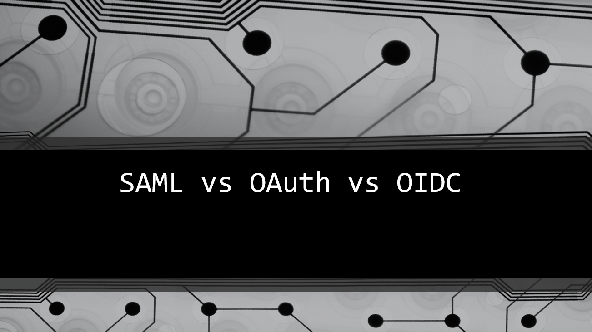
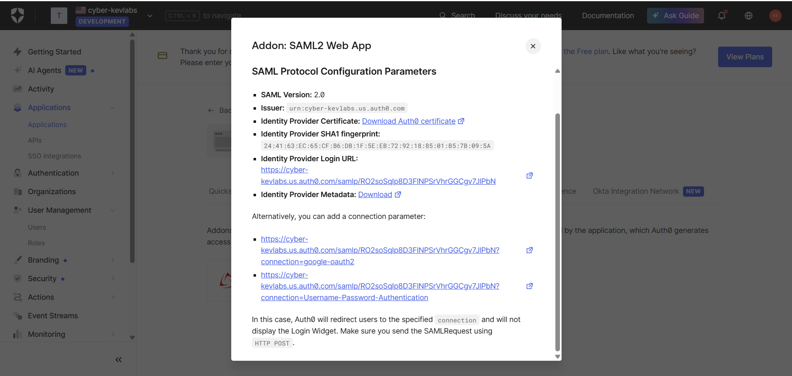
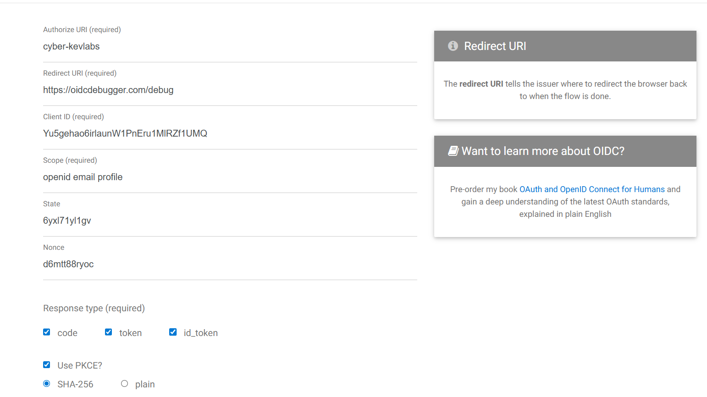
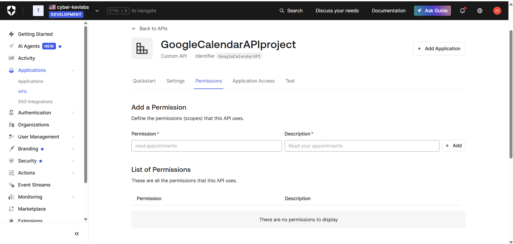

# IAM Federation Lab: SAML, OAuth 2.0, and OIDC, with Auth0

## Overview
This project demonstrates hands-on identity federation using Auth0 tenant to test protocol behaviors. I built and tested SAML 2.0 SSO, OpenID Connect authentication, and OAuth 2.0 authorization flows. During this process, I configured a SAML web app to inspect XML assertions using SAML-tracer, and then set up an OIDC flow to decode JWTs and map claims.

## Full Lab Report
For a detailed write-up of the lab, configuration steps, results, troubleshooting, and lessons learned, see [docs/report.md](docs/report.md).

## Tools Used
- Auth0
- SAML Testing Tool
- OIDC Debugger
- JWT.io
- Hoppscotch

## Part 1: SAML 2.0 SSO
I configured Auth0 as the Identity Provider and a SAML testing application as the Service Provider.

Key concepts:
- Identity Provider
- Service Provider
- ACS URL
- Entity ID
- SAML metadata
- X.509 certificate
- SAML assertion

## Part 2: OpenID Connect
I configured an OIDC application in Auth0 and tested authentication using OIDC Debugger.

Key concepts:
- OpenID Provider
- Relying Party
- ID token
- JWT claims
- Redirect URI
- Scopes

## Part 3: OAuth 2.0
I configured a custom API in Auth0 and tested OAuth authorization using access tokens.

Key concepts:
- Resource server
- Client credentials flow
- Access token
- Audience
- Scopes
- Machine-to-machine authorization

## What I Learned
This lab helped me understand the difference between authentication and authorization.

SAML and OIDC are mainly used for authentication and SSO. OAuth 2.0 is used for authorization and API access.

