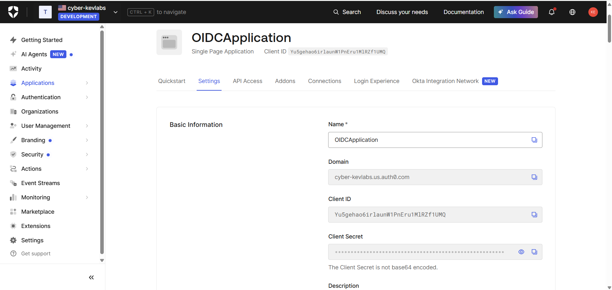
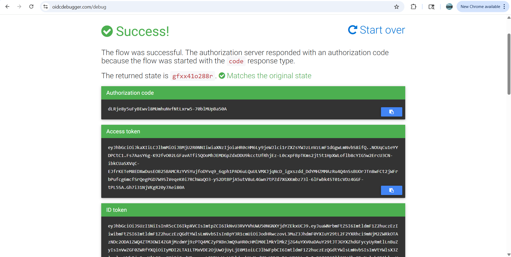
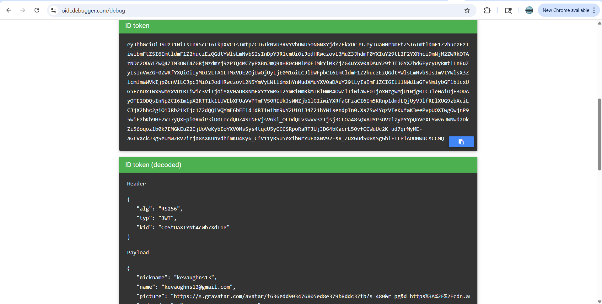
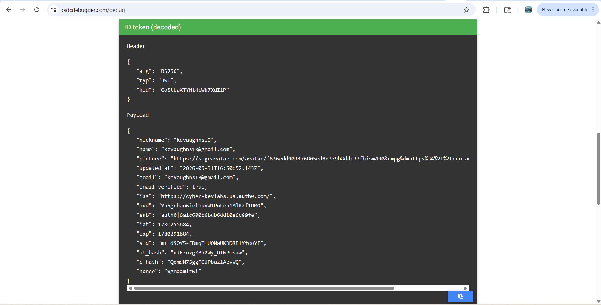
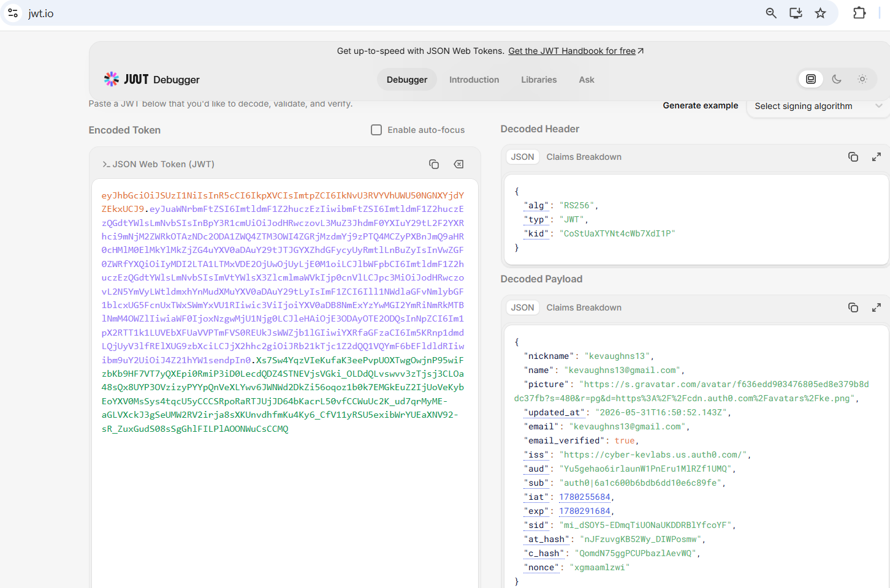

# Part 2 - OIDC (OpenID Connect) with Auth0

## Objective
The goal of this lab was to configure an OpenID Connect (OIDC) application in Auth0, connect it to the OIDC Debugger as the relying party, authenticate a user, and inspect the tokens returned by Auth0. In my test flow, the debugger returned an **authorization code**, an **access token**, and an **ID token**, which I then decoded to inspect the authentication claims.

---

## Lab Overview
In this lab, I used **Auth0 as the OpenID Provider (OP)** and **OIDC Debugger** as the client/relying party application. I created a **Single Page Application** in Auth0, configured the required callback URL, and then built an authentication request in OIDC Debugger using my Auth0 domain and client ID.

When I submitted the request and authenticated successfully, Auth0 returned:
- an **authorization code**
- an **access token**
- an **ID token**

I then reviewed the returned token data in the debugger and decoded the ID token to inspect claims such as the issuer, audience, subject, email, and expiration.

This lab showed how OIDC works in practice and how it differs from SAML by using **JWT-based tokens** instead of XML assertions.

---

## Tools Used
- **Auth0** – used as the OpenID Provider (OP)
- **OIDC Debugger** – used to build and send the OIDC authentication request
- **JWT.io** – used to decode and inspect the ID token
- **Web browser** – used to complete the login flow

---

# Step 1: Create and Configure the OIDC Application in Auth0

I first created an OIDC application in Auth0 that would act as the identity provider side of the flow.

## Actions performed
1. In the Auth0 dashboard, I navigated to **Applications > Applications**.
2. I created a new application and selected **Single Page Application**.
3. I opened the application **Settings** page.
4. I copied the following values from the application:
   - **Domain**
   - **Client ID**
5. I configured the callback URL for the debugger by adding:
   - `https://oidcdebugger.com/debug`
6. I saved the changes.

## What this step accomplished
This created the OIDC application in Auth0 and allowed Auth0 to recognize the OIDC Debugger as a valid client application. The **Domain** identifies the Auth0 authorization server, while the **Client ID** uniquely identifies the OIDC application making the request.

---

# Step 2: Configure the OIDC Debugger Request

Next, I configured the **OIDC Debugger** so it could send an authentication request to Auth0.

## Actions performed
1. I opened the OIDC Debugger in the browser.
2. In the **Authorize URI** field, I configured the request to use my Auth0 authorization endpoint.
3. In the **Redirect URI** field, I used:
   - `https://oidcdebugger.com/debug`
4. In the **Client ID** field, I pasted the Auth0 application’s client ID.
5. In the **Scope** field, I entered:
   - `openid email profile`
6. In the response configuration, I selected:
   - **code**
   - **token**
   - **id_token**
7. I also enabled **PKCE** with **SHA-256**.
8. I submitted the request.

## OIDC request values used
- **Scope:** `openid email profile`
- **Redirect URI:** `https://oidcdebugger.com/debug`
- **Response types selected:** `code`, `token`, `id_token`
- **PKCE:** enabled using `SHA-256`

## What this step accomplished
This step built the OIDC authentication request and defined what Auth0 should return after authentication. By selecting **code**, **token**, and **id_token**, the debugger requested multiple response values from Auth0. Enabling **PKCE** added extra protection to the authorization flow by using a proof key challenge.

---

# Step 3: Authenticate Through Auth0

After submitting the request, the browser redirected me to Auth0 for authentication.

## Actions performed
1. I logged in with my Auth0 test user account.
2. Auth0 authenticated the user.
3. After successful login, Auth0 redirected me back to the OIDC Debugger callback page.

## What this step accomplished
This completed the authentication step between the client application and the OpenID Provider. Auth0 validated the user and returned the requested OIDC response values back to the debugger.

---

# Step 4: Review the Successful OIDC Response

After the redirect completed, the OIDC Debugger displayed a **Success** page showing the values returned from Auth0.

## What I observed
The debugger showed that the flow completed successfully and returned:

- **Authorization code**
- **Access token**
- **ID token**

It also showed that the returned **state** matched the original request, which is important because the state parameter helps protect against CSRF attacks during the authentication flow.

## Why this matters
This confirmed that the OIDC request was successful and that Auth0 returned the expected values back to the client. It also demonstrated that the flow was not limited to only an ID token — my configuration returned multiple artifacts from the authorization response.

---

# Step 5: Inspect the ID Token Returned by Auth0

From the successful response page, I reviewed the returned **ID token**. The ID token is the token used to communicate identity information about the authenticated user to the client application.

## What I observed
The debugger displayed the ID token in encoded form and also showed a decoded view of the token contents. This made it possible to inspect the user identity claims returned by Auth0 without needing to manually parse any XML.

## Why the ID token matters
The ID token is central to OIDC because it tells the application **who authenticated** and includes claims about the user and the authentication event.

---

# Step 6: Decode and Analyze the Token Claims

I then examined the decoded token contents to better understand what identity data Auth0 returned after authentication.

## Claims I observed in the decoded token
The decoded token contained values such as:

- **iss** – the issuer of the token (Auth0 tenant URL)
- **aud** – the intended audience of the token, which was my Auth0 client application
- **sub** – the unique identifier for the authenticated user
- **email** – the authenticated user’s email address
- **email_verified** – whether the email address had been verified
- **nickname** / **name** / **picture** – profile-related claims returned because the `profile` scope was requested
- **iat** – issued-at time
- **exp** – expiration time
- **nonce** – a value used to prevent replay attacks
- **sid** – session identifier
- **at_hash** – a hash value tied to the access token
- **c_hash** – a hash value tied to the authorization code

## Important observations from the token
A few claims were especially important for understanding the flow:

### `iss` (Issuer)
This identified **Auth0** as the system that issued the token.

### `aud` (Audience)
This identified the **OIDC application / client ID** the token was meant for.

### `sub` (Subject)
This was the unique user identifier representing the authenticated user account.

### `email`
This was returned because the request included the **email** scope.

### `nonce`
This helps prevent replay attacks by tying the response back to the original request.

### `at_hash` and `c_hash`
These claims appeared because the response included more than just an ID token. Since my response included an **access token** and an **authorization code**, Auth0 included hash values that bind those returned values to the ID token response.

## What this step accomplished
This step helped me understand how OIDC packages identity and flow-related information into a signed **JWT** rather than an XML assertion. I was able to see both **user claims** and **security-related claims** inside the token.

---

# Step 7: Decode the ID Token in JWT.io

To further inspect the token, I copied the ID token into **JWT.io**.

## What I observed in JWT.io
JWT.io showed:
- the **decoded JWT header**
- the **decoded JWT payload**
- the individual claims returned by Auth0

The JWT header showed the signing algorithm and token type, while the payload showed the user identity claims and token metadata.

## Why this mattered
Using JWT.io made it easier to inspect the token in a clean JSON format and verify that the claims in the ID token matched the information shown in the OIDC Debugger.

---

# Key OIDC Concepts Reinforced

## 1) OpenID Provider (OP)
The OpenID Provider is the identity system that authenticates users and issues OIDC tokens.  
In this lab, **Auth0** acted as the OpenID Provider.

## 2) Client / Relying Party
The client application is the system requesting authentication and receiving tokens.  
In this lab, the **OIDC Debugger** represented the client / relying party.

## 3) ID Token
The **ID token** is a JWT that contains identity claims about the authenticated user. It is the main token used by the client to confirm who logged in.

## 4) Access Token
The **access token** is typically used to access protected APIs. In this lab, it was returned as part of the OIDC response because the request included additional response types.

## 5) Authorization Code
The **authorization code** is a temporary code that can be exchanged for tokens in authorization code flows. Its presence in my debugger result showed that the response configuration requested more than a simple ID token-only response.

## 6) Claims
Claims are pieces of identity or token-related information stored in the JWT payload. Examples observed in this lab included:
- `iss`
- `aud`
- `sub`
- `email`
- `email_verified`
- `nonce`
- `sid`
- `at_hash`
- `c_hash`

## 7) Scopes
Scopes define what information the application is requesting from the identity provider.
- `openid` → required for OIDC
- `email` → requests email-related claims
- `profile` → requests user profile claims

## 8) PKCE
**PKCE (Proof Key for Code Exchange)** adds protection to the authorization flow by helping prevent interception of the authorization code. In this lab, PKCE was enabled using **SHA-256**.

---

# What I Learned

## OIDC is token-based rather than XML-based
Unlike SAML, which returns XML assertions, OIDC returns **JWT-based tokens**. This makes OIDC more lightweight and easier to inspect in modern web and mobile applications.

## The request configuration directly affects the response
Because I selected **code**, **token**, and **id_token** in the debugger, the response returned all three values rather than only an ID token.

## The ID token contains identity claims
The ID token included claims about the authenticated user such as:
- email
- name / nickname
- subject identifier
- issuer
- audience
- expiration

## OIDC responses can also include flow-specific security claims
Claims like **nonce**, **at_hash**, and **c_hash** showed how OIDC ties the returned values back to the original request and helps protect the flow.

## PKCE strengthens the authorization process
Enabling PKCE added an additional security layer to the request and is especially important for public clients like browser-based applications.

---

# Conclusion
In this lab, I successfully configured an **OIDC application in Auth0**, connected it to the **OIDC Debugger**, authenticated a user, and reviewed the tokens returned by Auth0. My debugger configuration returned an **authorization code**, an **access token**, and an **ID token**, which gave me a more complete view of how OIDC responses can be structured.

I then decoded the token data and inspected important claims such as:
- **iss**
- **aud**
- **sub**
- **email**
- **email_verified**
- **nonce**
- **at_hash**
- **c_hash**

Overall, this lab gave me hands-on experience with:
- creating an OIDC application in Auth0
- configuring redirect URIs and client identifiers
- building an authentication request in OIDC Debugger
- understanding how response types affect returned tokens
- decoding and analyzing JWT claims
- seeing how OIDC differs from SAML in a real authentication flow
