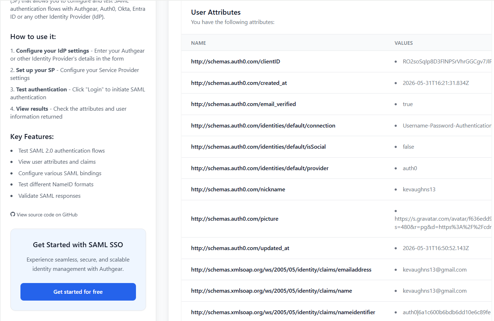
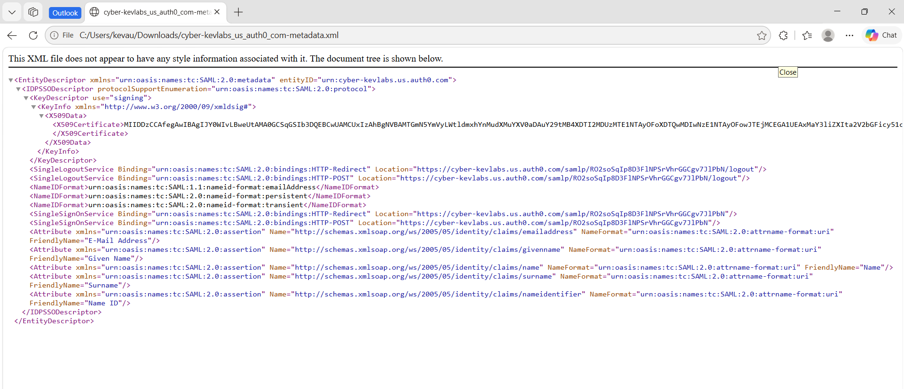
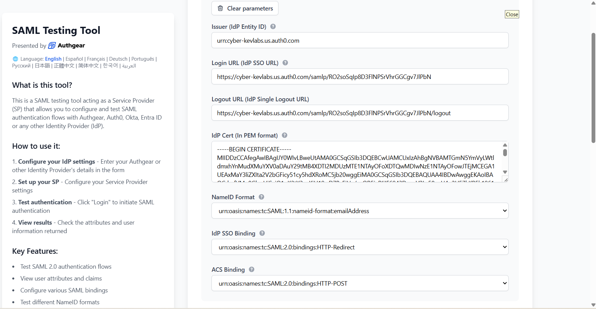

# Part 1 – SAML 2.0 SSO with Auth0

## Objective
In this part of the lab, I built an end-to-end **SAML 2.0 Single Sign-On (SSO)** integration using **Auth0 as the Identity Provider (IdP)** and **samlsp.com** as the Service Provider (SP). The goal was to understand how SAML trust is established, how metadata exchange works, and how user attributes are delivered in a SAML assertion after successful authentication.

---

## Technologies Used
- **Auth0**
- **SAML Testing Tool (samlsp.com)**
- **SAML 2.0**
- **XML Metadata**
- **Browser-based SSO testing**

---

## Architecture / Roles
This lab involved the two main parties in a SAML federation flow:

- **Identity Provider (IdP):** Auth0  
  The system responsible for authenticating the user and issuing the SAML response.

- **Service Provider (SP):** samlsp.com  
  The application receiving the SAML assertion and granting access to the user.

---

## Step 1 – Prepare the Service Provider (SP)
I started by opening **samlsp.com**, which acted as the Service Provider for this test. The SP page provided the values needed to configure Auth0 as the Identity Provider, specifically:

- **Assertion Consumer Service (ACS) URL**
- **Audience / Entity ID**

These values are required so Auth0 knows where to send the SAML response and which application the assertion is intended for.

### What this step taught me
This step reinforced that in SAML, the **Service Provider defines where assertions should be sent** and **how the Identity Provider identifies the application**. The ACS URL and Entity ID are core pieces of every SAML trust relationship.

---

## Step 2 – Configure Auth0 as the Identity Provider
Next, I created a new **Regular Web Application** in Auth0 and enabled the **SAML2 Web App** addon. In the SAML configuration, I pasted the ACS URL from the SP into the **Application Callback URL** field.

After enabling the addon, Auth0 generated the Identity Provider configuration values required for federation, including:

- **Issuer / IdP Entity ID**
- **Identity Provider Login URL**
- **Identity Provider Metadata**
- **Signing certificate details**

### What this step taught me
This step showed how an Identity Provider exposes its trust information to a Service Provider. Auth0 generated the values that define:
- who the IdP is,
- where authentication requests should be sent,
- and what certificate should be used to validate signed assertions.

---

## Step 3 – Exchange Metadata Between the IdP and SP
After configuring the Auth0 SAML addon, I used the **Identity Provider Metadata** link to download the metadata XML file. This metadata file contains the IdP configuration in a standard machine-readable format, including:

- the **Entity ID**
- **Single Sign-On URL**
- **Single Logout URL**
- **supported NameID formats**
- the **X.509 signing certificate**

I then returned to the SAML testing tool and uploaded the metadata XML into the **“Configuration parameters from your IdP”** section. Once uploaded, the tool automatically parsed the XML and populated the IdP configuration fields.

### Why metadata exchange matters
This was one of the most important parts of the lab. Instead of manually copying each SAML value one by one, I used **metadata exchange**, which is how many enterprise SAML integrations are actually set up in production.

The metadata import automatically filled in:
- **Issuer (IdP Entity ID)**
- **Login URL / IdP SSO URL**
- **Logout URL**
- **IdP certificate**
- **NameID format**
- **SAML bindings**

### What this step taught me
I learned that SAML metadata is essentially the **trust package** an Identity Provider gives to a Service Provider. It simplifies setup and reduces configuration mistakes because the SP can automatically import all required federation settings.

---

## Step 4 – Test Authentication
After the SP had the IdP metadata, I initiated the SAML login flow from the SAML testing tool. The flow redirected me to Auth0 for authentication and then redirected me back to the Service Provider with a successful SAML response.

The final result page showed the user attributes that were returned in the SAML assertion.

The returned attributes included user identity data such as:
- **email address**
- **name**
- **nameidentifier**
- **nickname**
- **provider / connection information**
- other Auth0 profile-related claims

### What this step taught me
This step tied the full flow together. I was able to see how a successful SAML login results in a **SAML assertion** containing user identity attributes that the Service Provider can consume for authentication and authorization decisions.

---

## Key Concepts Reinforced

### 1. Identity Provider (IdP)
The IdP is the system that authenticates the user and issues the SAML assertion. In this lab, **Auth0** acted as the IdP.

### 2. Service Provider (SP)
The SP is the application the user is trying to access. In this lab, **samlsp.com** acted as the SP.

### 3. ACS URL
The **Assertion Consumer Service (ACS) URL** is the endpoint on the Service Provider that receives the SAML response after the user successfully authenticates.

### 4. Entity ID
The **Entity ID** uniquely identifies either the IdP or SP in a SAML relationship. It acts as a logical identifier used to establish trust between systems.

### 5. Metadata Exchange
SAML metadata is an XML document that contains federation settings such as endpoints, certificates, and supported bindings. Importing metadata is a common enterprise method for configuring SAML trust.

### 6. X.509 Certificate
The IdP certificate is used to validate the authenticity and integrity of SAML responses. It allows the SP to verify that the assertion truly came from the trusted Identity Provider.

### 7. SAML Assertion
A SAML assertion is the XML payload sent by the Identity Provider after authentication. It contains statements about the user, such as identity attributes and authentication information.

---

## Challenges / Observations
During this lab, one of the most useful takeaways was seeing how **metadata import removes manual configuration work**. Instead of manually entering every SAML field, importing the XML file allowed the SP to automatically populate the required IdP settings.

I also observed how many user attributes can be included in a SAML response by default. This emphasized the importance of understanding which claims are being sent to a Service Provider and how those claims might be mapped in a real enterprise application.

---

## Security / IAM Relevance
This lab directly relates to IAM work because SAML is still widely used in enterprise environments for SSO into applications such as:
- internal business applications
- HR systems
- SaaS platforms
- legacy enterprise systems

By completing this lab, I practiced:
- configuring a SAML trust relationship
- working with IdP and SP settings
- understanding metadata exchange
- validating how user attributes are delivered after authentication
- connecting theory about SAML to an actual end-to-end implementation

---

## Outcome
At the end of the lab, I successfully configured a working **SAML 2.0 SSO integration** between Auth0 and a SAML Service Provider test application. I established trust using **metadata exchange**, authenticated through Auth0, and validated the user attributes returned in the final SAML assertion flow.
